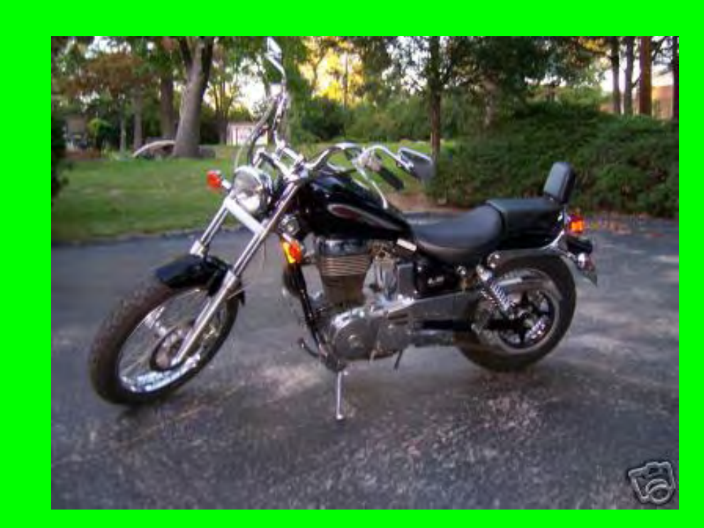

Quite Possibly The World’s Worst PowerPoint Presentation Ever 

A Demonstration of What NOT to do When Creating and Using PowerPoint Slide Shows

---

# How to Use this Presentation 

- Watch the slide show. 

- Gaze at the horrible examples of bad slide design and presentation. 

- Read the hints and tips slides that follow the examples to avoid making similar mistakes!

---

# Chilean Exports  

- Fresh fruit leads Chile's export mix - Chile emerges as major supplier of fresh fruit to world market due to ample natural resources, consumer demand for fresh fruit during winter season in U.S. and Europe, and incentives in agricultural policies of Chilean government, encouraging trend toward diversification of exports and development of nontraditional crops - U.S. Dept. of Agriculture, Economic Research Service Report- Chile is among the developing economies taking advantage of these trends, pursuing a free market economy. This has allowed for diversification through the expansion of fruit production for export, especially to the U.S. and Western Europe. Chile has successfully diversified its agricultural sector to the extent that it is now a major fruit exporting nation. Many countries view Chile's diversification of agriculture as a model to be followed.- Meanwhile, the U.S. remains the largest single market for Chile's fruit exports. However, increasing demand from the EC and Central and East European countries combined may eventually surpass exports to the U.S., spurring further growth in Chile's exports.- If you've read this far, your eyes probably hurt and you've been reading this tedious long-winded text instead of listening to me. I'm insulted- can't you see I'm doing a presentation up here? Look at me! Congratulations, however, on having such good eyesight.

---

Too Much Text, and Font too small 

- Don’t put large blocks of text in your presentation. 

- Emphasize the main points. 

- The “Six-by-Six” Rule. 

- Use pictures- PowerPoint is multimedia! 

- Use a large font…at least 30-point or more.

---

# Beginner Motorcycles 

 

- My personal favorite: the Suzuki Savage
- Light weight (~380lbs)
- Adequate power (650cc engine)
- Low seat height fits most riders

---

Bad Color Choices 

- Avoid loud, garish colors...dark text on light background is best. 

- Avoid text colors that fade into background, i.e. blue and black 

- Avoid color-blind combinations:
  - Red and green
  - Blue and yellow

---

---

Overwhelming Pictures 

- Use pictures, but don’t let them use you. 

- Keep slides SIMPLE! Too much diverts audience away from content. 

- Too many pictures also make saving a presentation difficult. 

- 1 or 2 pictures per slide is probably enough.

---

## Racquetball Fundamentals 

- 2, 3, or 4 players. 

- 1 player serves, other “returns.” 

- Only serving player can score. 

- Served ball must land past serving line and cannot hit back wall. 

- Ball can only bounce once before striking front wall…but ball does not have to bounce.

---

Using too much Slide Animation 

• Again, keep slides simple! 

• Apply one Slide Transition style and one Animation Scheme to ALL slides. 

• Don’t change between styles- a single style makes a presentation look unified. 

• “Busy” presentations divert audience attention from content.

---

FILE NOT FOUND 

- Microsoft PowerPoint is unable to open the requested file. This could be because your file is corrupted and/or this is an unsupported file type. Do you wish to retry or cancel? 

- Disk is unformatted. Click “yes” to format your disk now. 

- Boot startup failure, press any key to reboot.

---

## Murphy's Law 

- Something WILL go wrong- test your presentation before you show it. 

- Always have a backup of your presentation on hand. 

- Be prepared to do the presentation without the PowerPoint...professionals ALWAYS print handouts for the audience.

---

More Presentation tips 

- Talk to your audience, not the slides- face them! 

- Don’t just read what’s on the board…we can read that. Use a visual presentation as a starting point. 

- Avoid apologizing for a presentation shortcomings…press on. 

- Leave time for Q & A.

---

More Presentation tips, cont. 

- Check grammar! A presentation is the worst time to see misspelings. 

- Don’t make too many slides…avoid the “slide rush” (trying to rush through the last 20 slides because you ran out of time). 

- Cite your sources on each slide or at the end of your presentation. 

- Remember: KEEP IT SIMPLE! It’s just a tool!